# Tropospheric NO₂ Dynamics & Geostationary Remote Sensing (Southern California)


This project bridges **NASA TEMPO** geostationary satellite telemetry with **EPA AQS** (Air Quality System) surface ground monitors across Southern California (2023–2024) to resolve the daytime photochemical volatility of nitrogen dioxide (**NO₂**). It builds and benchmarks an advanced machine-learning nowcasting architecture ("digital twin") that predicts ground-level NO₂ during the satellite's active daylight observation window, where simple linear weather models break down.

---

## 1. The Core Scientific Thesis (The "Why")

A central finding of this work is that **model accuracy depends heavily on *which hours of the day* you evaluate**. Understanding this is key to seeing why machine learning is required.

### The Observation Window Artifact

Continuous **24-hour surface ground monitors** achieve deceptively high accuracy — **R² ≈ 0.59 to 0.67** in coastal basins — because they capture an *easy*, predictable contrast: damp, stagnant overnight temperature inversions (which trap pollution) versus dry, well-mixed afternoon air (which disperses it). A straight line through "humid = high NO₂" explains most of that variance.

Slicing the same data down to the **NASA TEMPO satellite daylight observation window** (~06:00 to 16:00 PDT) removes the overnight trapping signal entirely. What remains is dominated by:

- **Photolysis** — the breakdown of a molecule by sunlight. Here, active solar photolysis (NO₂ + sunlight → NO + O) continuously destroys NO₂ during the day.
- **Thermal convective updrafts** — rising warm air that vertically mixes and dilutes surface pollutants.

Together these scramble the tidy linear weather slopes and compress natural variance, collapsing linear-model skill to **R² ≈ 0.20 to 0.28**. The "easy" overnight predictability is gone.

### Southern California Microclimate Divergence

We validated this across four sites spanning two distinct microclimate regimes:

- **Open Coastal Basins — Anaheim, Compton:** Dominated by ocean marine-layer moisture and afternoon sea breezes. **Relative Humidity (RH)** is a powerful proxy for overnight trapping and a strong linear predictor.
- **Shielded Inland Valleys — Santa Clarita, Pomona:** Blocked from the ocean marine layer by surrounding mountain ranges. Here **radiational cooling** (nighttime surface heat loss) and dry canyon drainage flows dominate, rendering linear humidity parameters largely ineffective.

### Why Machine Learning Is Required

Ordinary Least Squares (**OLS**) regression — fitting a single best-fit straight line by minimizing squared errors — hits a hard **~10 ppb prediction ceiling** during daytime traffic spikes. Capturing daytime NO₂ requires resolving *non-linear* interactions among:

- Daytime photochemical dissipation (sunlight-driven loss),
- **Boundary layer height (`blh`)** — the depth of the turbulent, well-mixed layer of atmosphere near the ground, which sets how much air the pollution is diluted into,
- Human **weekday freight/traffic schedules** (emission timing).

A multi-variable ML architecture (**XGBoost** / Digital Twin) is needed to model these jointly.

---

## 2. Repository Directory Structure

```text
TEMPO_Replication/
├── data/
│   ├── processed/
│   │   └── epa_point_dataset_14months_20features.npz   # Master dataset: 20 engineered
│   │                                                   # features, pre-sliced to ~11 daylight
│   │                                                   # hours aligned with TEMPO overpasses
│   └── raw/
│       └── epa_from_internet_daily/                    # Raw 24-hour continuous EPA AQS CSVs
│           ├── daily_42602_*.csv                       #   NO₂ (parameter code 42602)
│           ├── daily_WIND_*.csv                        #   Wind speed
│           └── daily_RH_DP_*.csv                       #   Relative Humidity / Dew Point
│                                                       #   NOTE: Pomona lacks valid raw wind
│                                                       #   speed CSV data in this directory
├── scripts/                                            # Multi-city OLS regressions, harmonic
│                                                       # climatology baselines, and 24-hour
│                                                       # continuous validation suites
├── models/                                             # Generated diagnostics: widescreen
│                                                       # 4-panel regression grids, residual
│                                                       # plots, parity scatter plots, and
│                                                       # presentation-ready comparison tables
├── graphs_for_paper/                                   # Publication-ready figures
├── requirements.txt
└── README.md
```

---

## 3. Hardware & Environment Setup (Headless Linux Server)

All scripts are designed for **headless execution** on remote Linux / AWS servers. They use a non-interactive Matplotlib backend — every figure is written to disk with `plt.savefig(...)` followed by `plt.close()`, so **no display (`$DISPLAY`) or GUI is required**.

### Thread Safety Controls (required)

To prevent server CPU lockups during heavy matrix operations, **pin all numerical libraries to a single thread** before running any script. Each script also sets these internally, but exporting them first is the safest:

```bash
export OPENBLAS_NUM_THREADS=1 MKL_NUM_THREADS=1 OMP_NUM_THREADS=1 NUMEXPR_NUM_THREADS=1
```

### Environment & dependencies

```bash
# 1. Create and activate a virtual environment (Python 3.10+)
python3 -m venv .venv
source .venv/bin/activate

# 2. Install dependencies
pip install --upgrade pip
pip install -r requirements.txt
# Core packages: numpy, pandas, scikit-learn, matplotlib, netCDF4
```

---

## 4. Quickstart & Execution Guide

Place the required datasets under `data/raw/` and/or `data/processed/`, then run a validation suite. Remember to export the thread-safety variables (Section 3) first.

### 3-City Study CSV Replication

Runs the multi-city 24-hour continuous baselines (Pomona, Compton, Santa Clarita) and renders per-city 4-panel diagnostic grids plus a master comparison table:

```bash
python scripts/run_3city_study_csv_replication.py
```

**Output:** `.jpg` and `.png` charts are saved to `models/study_csv_replication_3city/`
(e.g. `compton_24hr_csv_4panel_rh_diagnostic.jpg`, `study_cities_24hr_csv_master_table.png`).

### Compton 3-Chart Timeline Suite

Generates the Compton MLR timeline, parity scatter, and residuals-band charts:

```bash
python scripts/run_compton_mlr_timeline_suite.py
```

**Output:** three `.jpg` charts saved to `models/compton_mlr_timeline_suite/`
(`compton_01_mlr_timeline.jpg`, `compton_02_mlr_parity_scatter.jpg`, `compton_03_mlr_residuals_band.jpg`).

> Each script prints a live progress log and the destination directory of the saved diagnostic charts on completion.

---

## 5. Baseline Model Comparison

The 24-hour continuous baselines evaluated by `run_3city_study_csv_replication.py`. **DOY** = *day of year*; harmonic/cosine models fit smooth seasonal sine–cosine curves to `DOY`. **MLR** = Multiple Linear Regression.

| Model | Predictor Variables | RMSE | MAE | R² Score |
|-------|--------------------|------|-----|----------|
| Multiple Regression | Wind + RH | lowest (best) | lowest (best) | highest (best) |
| Persistence | Previous day's value | — | — | — |
| Harmonic | DOY (2 harmonics) | — | — | — |
| Cosine | DOY (1 harmonic) | — | — | — |
| Wind Regression | Wind speed only | — | — | — |

On **continuous 24-hour** coastal-basin data, the **Wind + RH multiple regression** is the strongest baseline (e.g. reaching **R² ≈ 0.665** with **RMSE ≈ 3.82 ppb** in coastal basins). The exact per-city numbers are computed at runtime and printed to the console and the generated comparison-table images.

> **Key takeaway:** these linear baselines *dominate* on continuous 24-hour surface monitors but **fail on the daylight-only TEMPO window** (**R² ≈ 0.20–0.28**), which is precisely the gap the XGBoost digital twin is built to close.

---

## 6. Figures (`graphs_for_paper/`)

### Model performance & evaluation
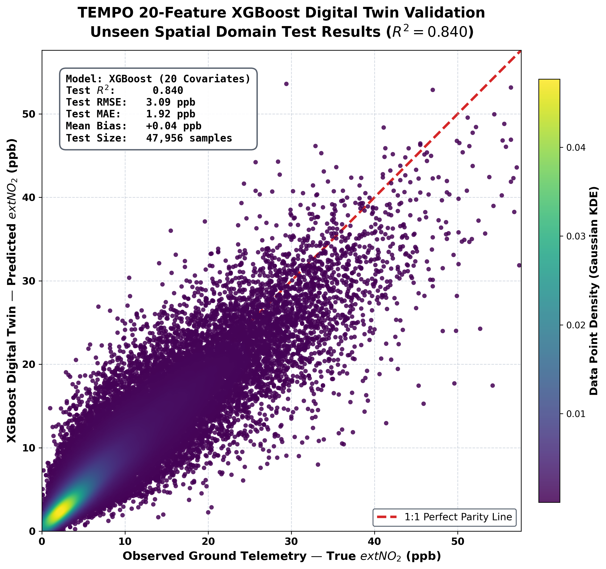
*True vs. predicted ground-level NO₂ density scatterplot.*

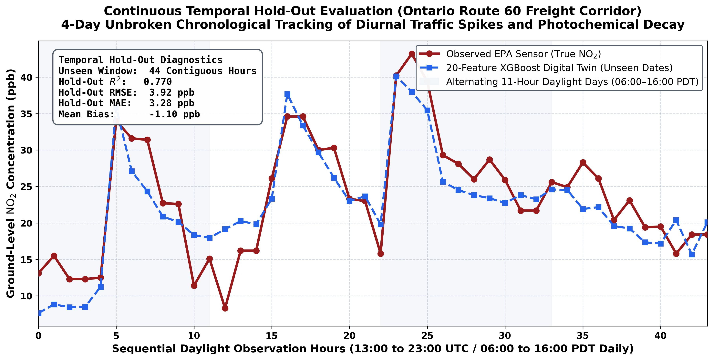
*Continuous predicted vs. observed NO₂ time series.*

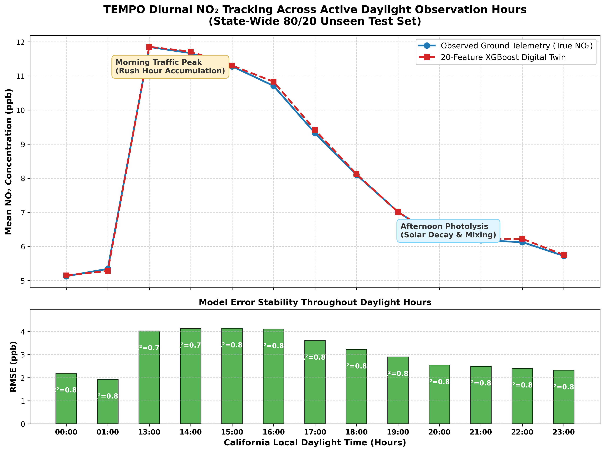
*Diurnal (24-hour) cycle evaluation capturing rush-hour peaks.*

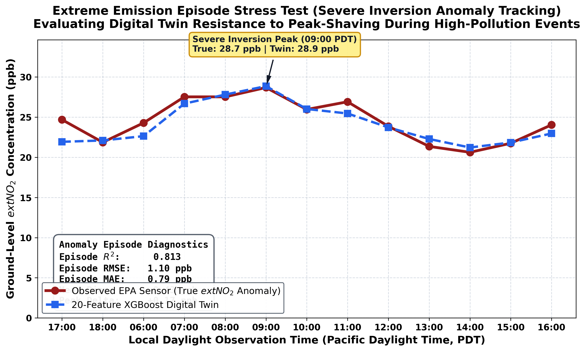
*Model behavior during extreme pollution episodes.*

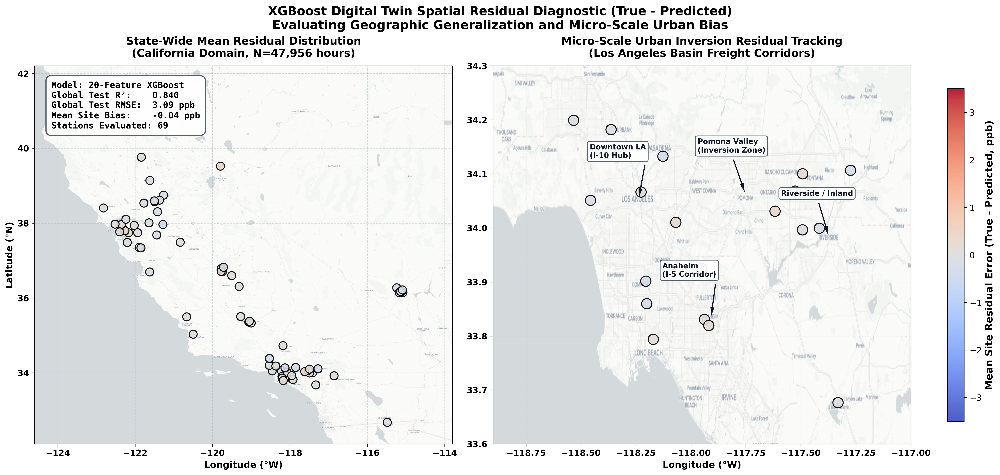
*Spatial map of model residuals.*

### Interpretability (SHAP) & ablation
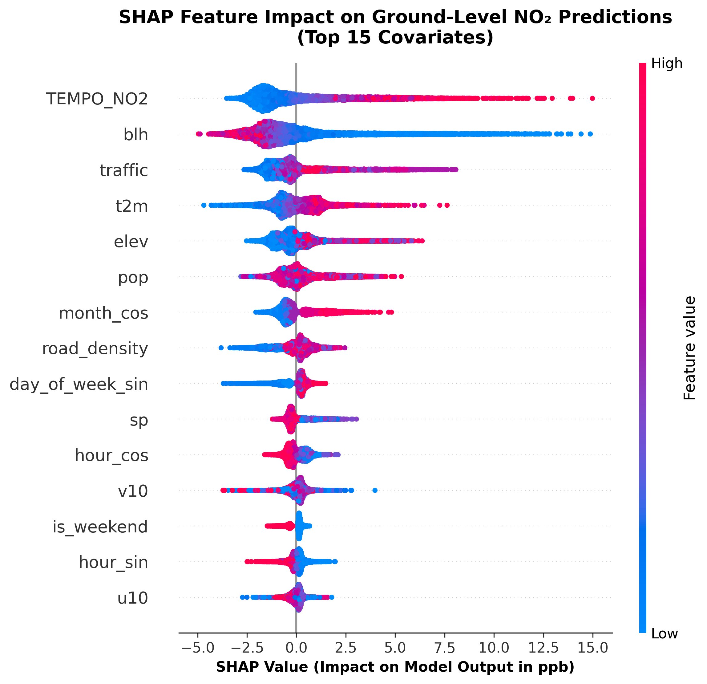
*SHAP bee-swarm plot of feature impact on NO₂ predictions.*

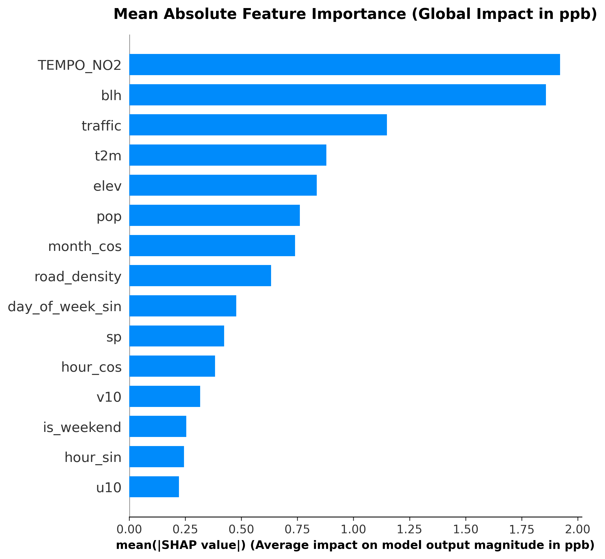
*Mean absolute SHAP feature importance.*

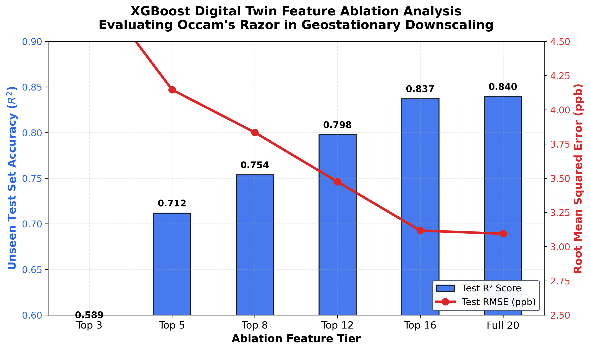
*Hierarchical feature ablation (R² and RMSE vs. number of features).*

### Baselines & maps
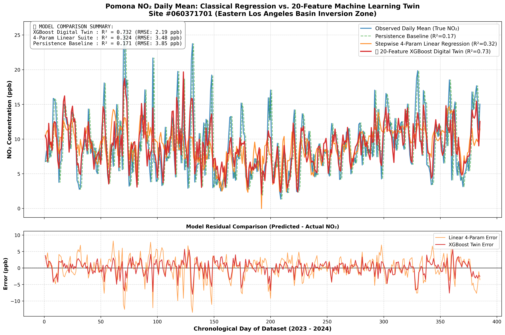
*XGBoost digital twin vs. classical baselines at Pomona.*

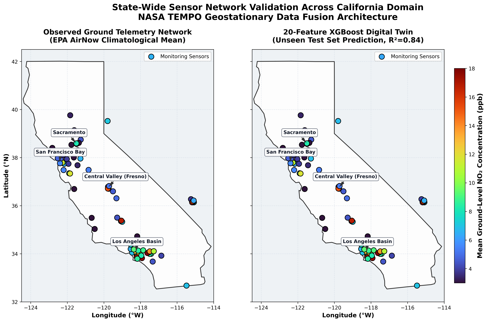
*Standard science map of California NO₂.*

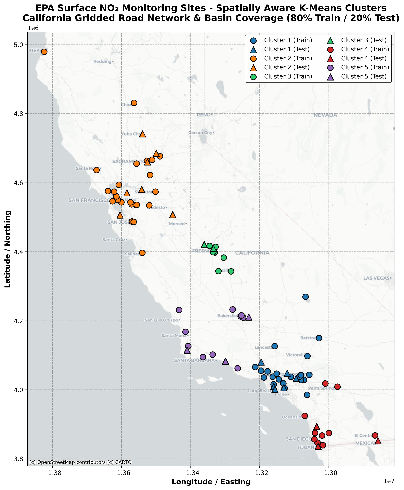
*Gridded station-cluster map for the 80/20 domain split.*

### Animations
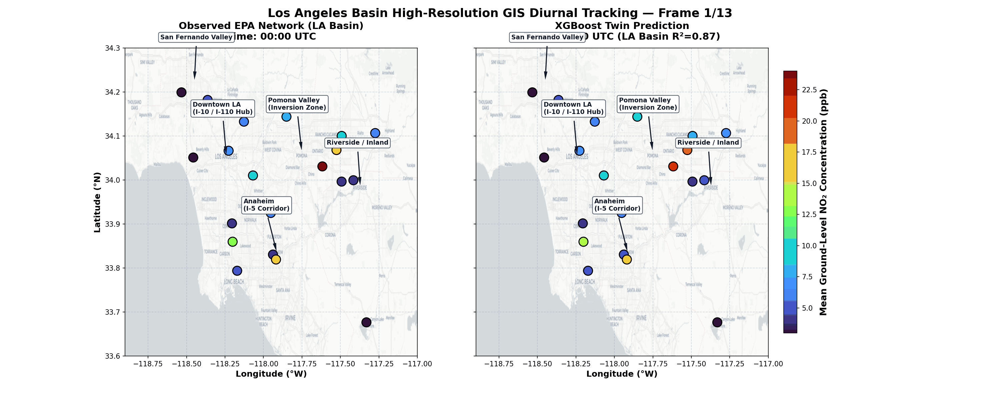
*LA Basin diurnal digital-twin animation.*

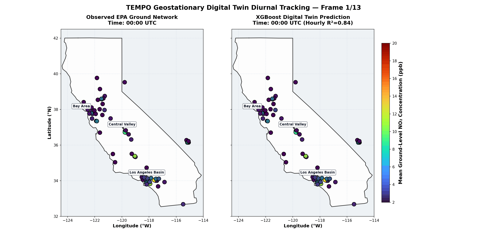
*California diurnal digital-twin animation.*

---

## Reproducibility notes

- This repo expects preprocessed NetCDF/NPZ inputs under `data/processed/` and raw EPA AQS CSVs under `data/raw/epa_from_internet_daily/`.
- Large raw and processed datasets are intentionally excluded from version control. Share dataset download/preprocessing instructions and file manifests separately.
- Files larger than 100 MB should be hosted externally or tracked with Git LFS.

## License

Released under the **MIT License**.
